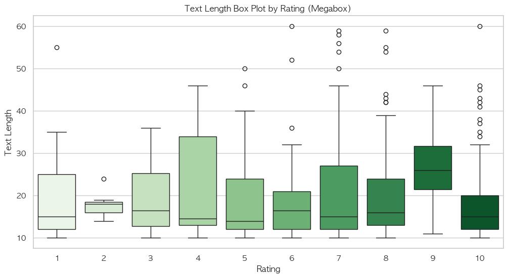

# YBIGTA_newbie_team_project

## 실행 방법
```
git clone https://github.com/JongseoKang/YBIGTA_newbie_team_project
pip install -r requirements.txt
cd ./app
uvicorn main:app --reload
```
브라우저를 이용하여 http://127.0.0.1:8000/static/index.html 접속

## 조장


### 이름: 강종서

### 학번: 20학번

### 전공: 컴퓨터과학과

### 관심사
안녕하세요. 증명사진 눈갱 죄송합니다 ㅎㅎ..

컴파일러 최적화에 관심이 있는 컴과 4학년입니다.

인공지능은 잘 몰라서 열심히 배우겠습니다. 잘 부탁드립니다 !

---

## 조원


### 이름: 박하늘

### 학번: 20학번

### 전공: 산업공학과

### 관심사
안녕하세요, 박하늘입니다.

LLM, GNN에 관심을 갖고 있습니다.

앞으로 잘 부탁드립니다!

---
branch_protection.png


push_rejected.png


merge_JongseoKang.png


merge_0haneu1.png


# EDA/FE 및 시각화

## Dependencies
```
pip install pandas gensim konlpy numpy
brew install openjdk
```

# 1. 전처리 및 FE 결과

## 전처리

null 값을 포함, 1-10이 아닌 별점 포함 또는 길이 10-60이 아닌 텍스트 포함의 데이터를 삭제하였으며 결과적으로 네이버 리뷰는 163개, 메가박스 리뷰는 463개의 데이터 획득

## FE 추가된 변수
개봉 이후 시간대 별로 작성된 리뷰의 개수

텍스트 벡터화(word2vec)

# 2. 시간대별 리뷰 개수, 사이트별 리뷰 길이 차이

## 시간대별 리뷰 개수

네이버 영화 리뷰가 전체 텍스트의 개수가 더 낮음에도 초기에 더 많은 리뷰 개수를 기록하였다. 이는 영화를 시청하지 않고도 리뷰를 작성할 수 있는 시스템의 차이로 인한 것으로 추정된다.

## 사이트별 리뷰 길이 차이

네이버 영화 리뷰의 경우 전반적으로 고른길이 분포를 보였으나 메가박스 영화 리뷰의 경우 길이 15이하의 리뷰가 다수를 차지 하였다.

# 3. 사이트별 비교분석

## EDA와 기초통계량

전처리를 거친 히트맨 2에 대한 두 개의 영화 사이트 리뷰 데이터로 시각화 및 분석을 진행하였다. 

데이터의 기초통계량과 각 평점 rating 의 분포를 수치로 보면 다음과 같다.

-- NaverMovie Rating Stats ---
Total Reviews (Valid): 163
Mean: 7.52760736196319
Median: 8.0
Variance: 8.05324547451334
Std Dev: 2.837824073918843

-- Megabox Rating Stats ---
Total Reviews (Valid): 463
Mean: 7.518358531317495
Median: 8.0
Variance: 5.8692509794021515
Std Dev: 2.4226537060426425

-- NaverMovie Rating Distribution ---
rating
1 8
2 8
3 1
4 9
5 13
6 16
7 12
8 19
9 3
10 74
Name: count, dtype: int64

-- Megabox Rating Distribution ---
rating
1 13
2 7
3 12
4 24
5 31
6 60
7 65
8 66
9 26
10 159
Name: count, dtype: int64

## 변수 별 비교분석


평점의 barplot이다. 두 사이트에 대해 모두 10점이 최빈값이고, 나머지 평점에 대해서는 고르지 않게 분포해있는 모습을 볼 수 있다.


두 사이트의 평점을 boxplot으로 봤을 때에는 분포가 유사해보이는 모습이다.


다음은 리뷰 길이의 분포를 barplot 으로 표현한 그림이다. 네이버에 비해 메가박스 리뷰의 길이는 10자 대의 짧은 리뷰가 많고, 길이가 길어질수록 리뷰의 수가 적어지는 것을 볼 수 있다. 반면 네이버 리뷰의 경우 10자 대의 짧은 리뷰가 비교적 많지만, 고르게 분포해있지 않으며 50자 대의 리뷰의 수도 많은 것을 확인할 수 있다.


boxplot으로 보면 위의 내용을 더욱 극명하게 알아볼 수 있다.


다음은 개봉일 22일 이전부터 개봉일 이후까지 리뷰를 작성한 연속적 시각 별로 리뷰 개수의 분포를 확인한 것이다. 네이버의 경우 대부분 1월 23일 00시 이전에 밀집해있으며, 메가박스의 경우 23일 00시 이후에 밀집해있는 모습을 볼 수 있다.


네이버 리뷰에서 0시부터 24시에 대해, 어떤 시간에 올린 리뷰의 텍스트 길이가 길었는지에 대한 violin plot이다. 많은 리뷰의 텍스트 길이가 20 이상에 분포한다. 11시에서 17시 사이의 리뷰 작성량과 리뷰의 길이가 다른 시간대에 비해 비교적 많은 것도 확인할 수 있다.


메가박스 리뷰도 같은 Plot으로 알아보았다. 네이버에 비교해보았을 때, 비교적 전 시간대에 걸쳐 고르게 작성하였으나 12시 이후의 작성량이 많은 편이다. 또한 네이버에 비해 전 시간대에 걸친 리뷰의 길이가 짧은 것을 확인할 수 있다.


x축을 평점, y축을 텍스트 길이로 하는 KDE Plot이다. 이를 통해 네이버의 경우 점수가 높은 리뷰가 많으며, 점수가 높은 리뷰는 텍스트 길이가 긴 편임을 확인할 수 있다. 메가박스 리뷰의 경우에는 비교적 점수가 고르게 분포해있으며 텍스트 길이는 점수에 관계 없이 텍스트 길이가 비교적 짧은 편이라는 것을 확인할 수 있다. 이는 앞선 분석들에서 살펴본 것과 동일한 분석 결과를 낳는다. 


리뷰의 평점과 텍스트 길이에 대해 boxplot으로 비교하였다. 네이버 리뷰의 경우 점수에 대한 리뷰의 길이가 고르진 않은 편이다. 특히 점수가 10점인 리뷰에 대해서는 텍스트 길이가 다양하게 분포해있고 전반적으로 길이가 긴 편임을 확인할 수 있다.




메가박스 리뷰의 경우 점수에 대한 리뷰의 길이가 전반적으로 20 이하에 분포하는 모습을 볼 수 있다.

